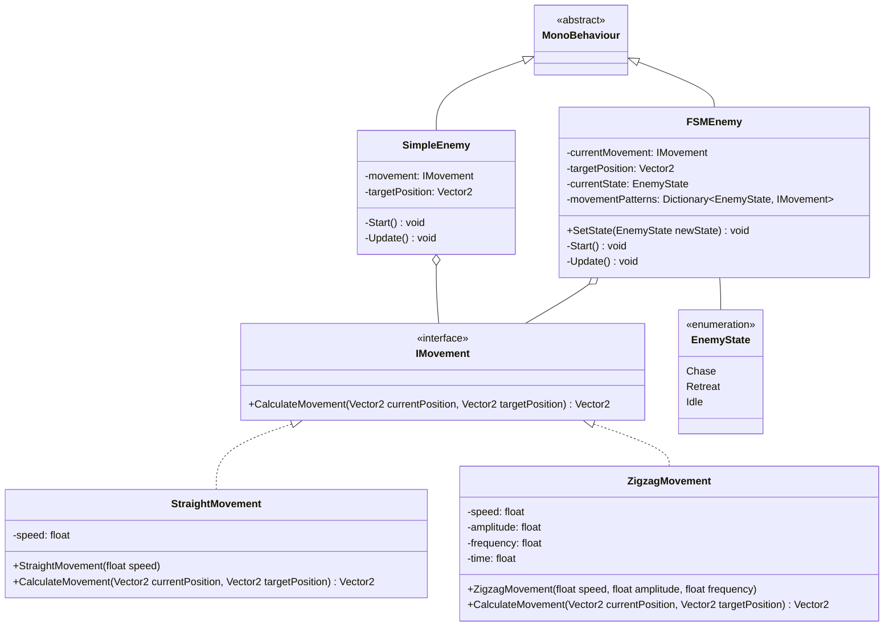

```mermaid
classDiagram
    class IMovement {
        <<interface>>
        +CalculateMovement(Vector2 currentPosition, Vector2 targetPosition) Vector2
    }

    class StraightMovement {
        -speed: float
        +StraightMovement(float speed)
        +CalculateMovement(Vector2 currentPosition, Vector2 targetPosition) Vector2
    }

    class ZigzagMovement {
        -speed: float
        -amplitude: float
        -frequency: float
        -time: float
        +ZigzagMovement(float speed, float amplitude, float frequency)
        +CalculateMovement(Vector2 currentPosition, Vector2 targetPosition) Vector2
    }

    class FSMEnemy {
        -currentMovement: IMovement
        -targetPosition: Vector2
        -currentState: EnemyState
        -movementPatterns: Dictionary~EnemyState, IMovement~
        +SetState(EnemyState newState) void
        -Start() void
        -Update() void
    }

    class SimpleEnemy {
        -movement: IMovement
        -targetPosition: Vector2
        -Start() void
        -Update() void
    }

    class MonoBehaviour {
        <<abstract>>
    }

    class EnemyState {
        <<enumeration>>
        Chase
        Retreat
        Idle
    }

    IMovement <|.. StraightMovement
    IMovement <|.. ZigzagMovement
    MonoBehaviour <|-- FSMEnemy
    MonoBehaviour <|-- SimpleEnemy
    FSMEnemy o-- IMovement
    SimpleEnemy o-- IMovement
    FSMEnemy -- EnemyState
```
