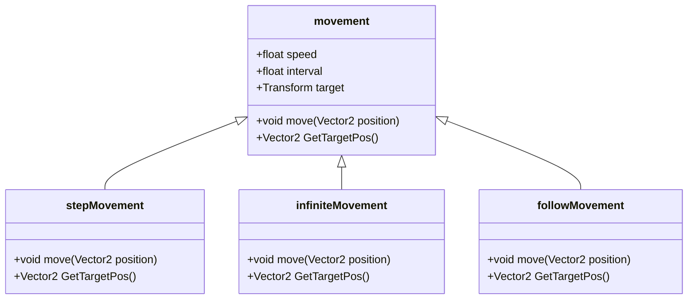

```mermaid
classDiagram
    class movement {
        +float speed
        +float interval
        +void move(Vector2 position)
        +Transform target
        +Vector2 GetTargetPos()
    }

    class stepMovement {
        +void move(Vector2 position)
        +Vector2 GetTargetPos()
    }

    class infiniteMovement {
        +void move(Vector2 position)
        +Vector2 GetTargetPos()
    }

    class followMovement {
        +void move(Vector2 position)
        +Vector2 GetTargetPos()
    }

    movement <|-- stepMovement
    movement <|-- infiniteMovement
    movement <|-- followMovement

```
