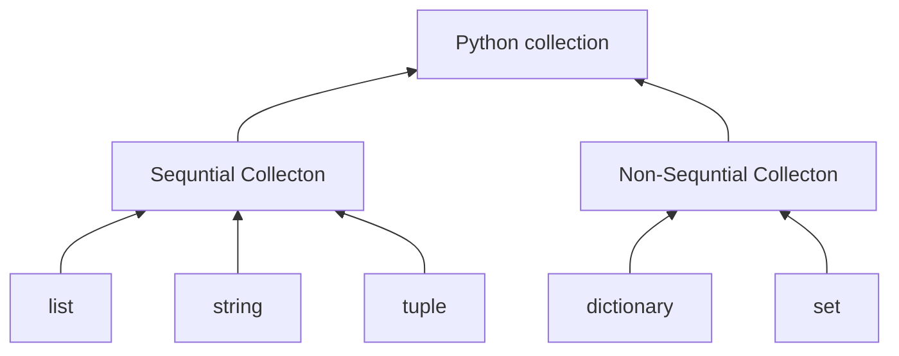

---
tags:
  - school
  - Algorythem
subject: Algorythem
---
# 상속이란
- **상속**<sub>inheritance</sub> 객체 지향 프로그래밍의 또다른 주요 요소
- 클래스를 선언 할 때 다른 클래스의 속성과 메소드를 상속 가능
- 상속을 받는 클래스: 자식/하위 클래스
- 상혹을 하는 클래스: 부모/상위 클래스
## 상속을 하는 클래스 선언
```python
class 자식클래스(부모클래스):
	클래스본문
```
## 모음 자료형의 상속 구조

[출처](https://runestone.academy/ns/books/published/pythonds3/Introduction/ObjectOrientedProgramminginPythonDefiningClasses.html)
# `Vector` 클래스
벡터는 정수 또는 부동소수점으로 이루어진 리스트와 유사한 모음 자료형이다. Numpy의 1차원 어레이array가 대표적인 벡터 자료형이다. 벡터는 벡터 자체의 길이, 내적 등 리스트와는 다른 속성과 기능을 제공한다.
## `vc`