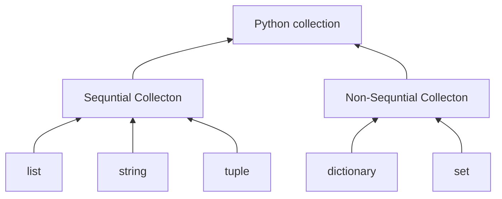

---
tags:
  - school
  - Algorythem
  - Python
subject: Algorythem
---
# 상속이란
- **상속**<sub>inheritance</sub> [[객체지향 프로그래밍의 특징#상속|객체 지향 프로그래밍]]의 또다른 주요 요소
- [[1. 클래스, 인스턴스, 객체|클래스]]를 선언 할 때 다른 클래스의 속성과 메소드를 상속 가능
- 상속을 받는 클래스: 자식/하위 클래스
- 상혹을 하는 클래스: 부모/상위 클래스
## 상속을 하는 클래스 선언
```python
class 자식클래스(부모클래스):
	클래스본문
```
## 모음 자료형의 상속 구조

[출처](https://runestone.academy/ns/books/published/pythonds3/Introduction/ObjectOrientedProgramminginPythonDefiningClasses.html)
# `Vector` 클래스
벡터는 정수 또는 부동소수점으로 이루어진 리스트와 유사한 모음 자료형이다. Numpy의 1차원 어레이<sub>array</sub>가 대표적인 벡터 자료형이다. 벡터는 벡터 자체의 길이, 내적 등 리스트와는 다른 속성과 기능을 제공한다.
## `Vector`클래스 선언
```python
class Vector(list):

	def __init__(self, items):
		super().__init__(items)
		self.len = self.__len__()
		
	def dot(self, other):
			if self.len != other.len:
				raise RuntimeError("두 벡터의 길이가 다르다")
			sum = 0
			for i in range(self.len):
				sum += self[i] * other[i]
			return sum
```
- `super().__init__()`: 부모 클래스의 생성자 호출. 자식 클래스를 호출 할때 보모 클래스의 메소드와 속성을 모두 상속받음
- `dot()`: 새로 추가되는 메서드. 두 벧터의 내적 반환
- `len`속성: 새로 추가되는 인스턴스 속성. 벡터의 길이
## `list` 상속
```python
x = Vector([2,3,4])
y = Vector([5,6,9])

>>> print(x)
[2,3,4] """ __str__() 메서드 상속 """
>>> x.dot(y)
64
```
이렇게 `list`를 상속받아 따로 정의하지 않았어도 파이썬 리스트의 모든것을 사용 가능하다.
## 메서드 재정의
`append, pop` 을 할 때 길이가 업데이티 되지 않는 버그가 샹겼다
### `append()`, `pop()` 메서드 재정의
```python
def append(self, item):
	super().append(item) #부모 클래스의 append 호출
	self.len = __len__() # 길이 다시 확인
def pop(self, idx = -1):
	super().pop(idx) # 부모 클래스의 pop 호출
	self.len = __len__() # 길이 업데이트
```