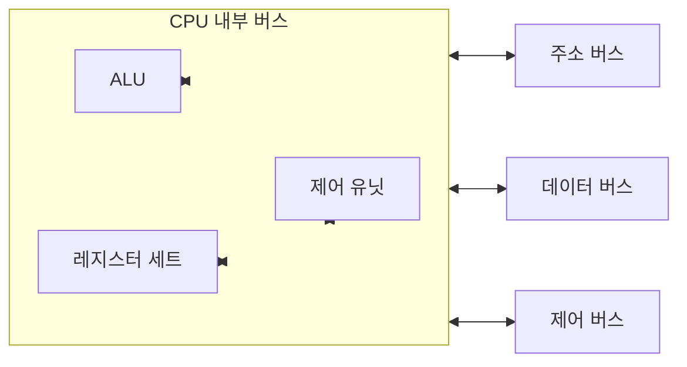

# 차례
1. CPU의 기본 구조
2. 면령어 실행
3. 명령어 파이프라이닝
4. 명령어 세트
# 0. CPU의 기능
#### 프로그램 수행
##### 모든 명령어에 대해 공통적으로 수행하는 기능
- cpu가 기억장치에 저장된 명령어를 실행
- **명령어 인출** (Instruction Fetch): 기억장치로부터 명령어를 읽음
- **명령어 해독** (Instruction Decode): 수행해야 할 동작을 결정하기 위해 인출된 명령어를 해독
##### 명령어에 따라 필요한 경우에 수행하는 기능
- **데이터 인출** (Data Fetch): 명령얼 실행을 위하여 데이터가 필요한 경우  기억장치 또는 입출력장치로부터 그 데이터를 읽음
- **데이터 처리** (Data Process): 데이터에 대한 산술적 또는 논리적 연산을 수행
- **데이터 쓰기** (Data Store): 수행한 결과를 저장
# 1. CPU의 기본 구조
> [!example]- CPU의 기본 구조

