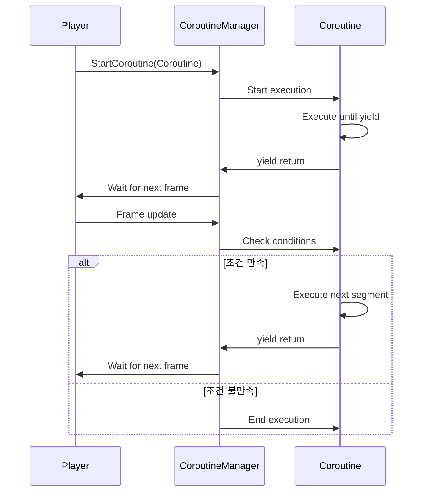

유니티에서 코루틴(Coroutine)은 비동기적으로 실행되는 함수로, 특정 작업을 지연시키거나 반복하는 데 유용합니다. 코루틴은 `IEnumerator`를 반환하는 함수를 통해 구현되며, `yield` 키워드를 사용하여 실행을 일시 중지할 수 있습니다.

### 코루틴 실행 과정 설명

1. **코루틴 시작**: `StartCoroutine` 메서드를 호출하여 코루틴을 시작합니다.
2. **첫 번째 실행**: 코루틴 함수가 호출되고, 첫 번째 `yield` 문까지 실행됩니다.
3. **일시 중지**: `yield`에 정의된 조건에 따라 실행이 일시 중지됩니다.
4. **프레임 종료**: 유니티는 매 프레임마다 코루틴을 체크하며, 일시 중지된 코루틴의 상태를 확인합니다.
5. **재개**: 조건이 만족되면, 다음 `yield` 문까지 실행하고 다시 일시 중지합니다.
6. **종료**: 코루틴 내의 코드가 모두 실행되면, 코루틴이 종료됩니다.

### Mermaid 다이어그램

다음은 코루틴의 실행 과정을 표현한 Mermaid 다이어그램입니다.

