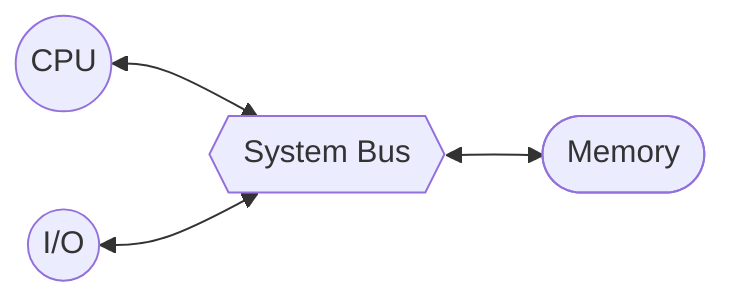

---
tags:
  - school
subject: Computer Structure/System
---

# 컴퓨터란
- 프로그램의 처리
- 프로그램: 기계어 명령어의 집합
- 즉 컴퓨터는 데이터 프로세싱 머신임
# 컴퓨터시스템의 구성
- 응용 소프트웨어
- 시스템 소프트웨어
- 하드웨어
# 컴퓨터의 기본 구조
- 컴퓨터는 프로그램 코드들을 정해진 순서대로 실행
	- 필요한 데이터를 읽어서(Read) 처리(Processing)하고 저장(Store)
- 기본 구성요소는 중앙 처리장치, 기억장치, 입출력 장치 가 있다

<b> 폰 노이만 아키텍처</b>

# 컴퓨터의 주요 구성요소
## 1. 중앙 처리 장치 (CPU)
- 프로세서 (Processer)
- '프로그램 실행'과 '데이터 처리'라는 중추적인 기능의 처리를 담당
## 2. 기억장치 (Memory)
- CPU가 실행할 프로그램과 데이터를 저장하는 장치
### 주 기억장치
- CPU 가까이 위치하며 반도체 기억장치 칩들로 구성
- 고속 엑세스
- 가격이 높고 면적을 많이 차지 ➡️ 저장 용량의 한계
- 영구 저장 능력이 없기 때문에 프로그램 실행 중에 일시적으로 사용
### 보조 기억장치
- 2차 저장장치
- 저장 밀도가 높고 비트당 가격이 낮음
- 엑세스 속도가 느림
- 영구 저장 능력을 가진 저장장치: HDD, CD-ROM, 플래시 메모리(Flash Memory) 등
## 3. 입출력 장치 (I/O Device)
- 사용자와 컴퓨터간의 대화를 위한 입력/출력 장치
- 유무선 통신 네트워크 인터페이스 장치
## 4. 시스템 버스
- CPU, 주 기억장치, I/O간의 통신
# 정보의 표현과 저장
- 컴퓨터 정보
	- 프로그램 코드와 데이터
	- 2진수 비트(0과 1)들로 표현
## 컴퓨터 언어의 분류
### 기계어 (Machine Language)
- 기계 코드, CPU가 이해할수 있는 언어
- CPU에 따라 다른 명령어 집합을 사용
- 2진수 비트로 구성
### 어셈블리 언어 (Assembly Language)
- 고급 언어와 기계어 사이의 중간 언어
- 저급 언어, 기계어와 1:1 대응
- 어셈블러(Assembler)로 번역
### 고급 언어 (High-Level Language)
- 영문자와 숫자로 구성되어 사람이 이해하기 쉬운 언어
- c++, 파스칼, 포트란, 코볼 등 ⬅️ 개틀딱 언어들
- 컴파일러(Compiler)를 이용하여 기계어로 번역
## 프로그램 언어 번역 소프트웨어
### 어셈블러
- 어셈블리 ➡️ 기계어
- 니모닉스()
	- 기예어 명령어가 어떤 역할을 하는디 대략적으로 유추할수 있도록 만든 기호
	- ex) 'LOAD', 'ADD', 'STOR' 등
### 컴파일러
- 고급 언어를 기계어로 바꿔주는 프로그램
## 기계 명령어의 형식
### 연산 코드 (OP Code)
- CPU가 수행할 연산을 지정해 주는 비트들
### 오퍼랜드 (Operand)
- 연산에 사용될 데이터 혹은 주소가 저장되 있는 기억장치 주소

| 연산 코드                | 오퍼랜드  |
| --- | --- |
| 
001
 | 
00101
 |
## 프로그램 코드와 데이터의 기억장치 저장
- 프로그램 코드와 데이터는 지정된 기억 장치에 저장
### 단어(Word)
- 각 기억 장소에 저장되는 데이터의 **기본 단위**
- CPU에 의해 한번에 처리 됭수 있는 비트들의 그룹
- 주소 지정 단위: 단어 단위 or 바이트 단위
# 프로그램 콘셉트
## 하드웨어 프로그래밍
- 일정한 상황에 커스텀된 하드웨어
- 새로운 프로그램을 만들때는 새 하드웨어 만들어야 함
- 유연하지 않음
## 범용 목정 하드웨어
- 컨트롤 시그널을 변경하는것으로 다른 일을 수행 가능함
- 다시 와이어링 하는 대신에 새로운 컨트롤 시그널의 집합을 제공한다
## 소프트웨어 프로그래밍
- 범용 목적으로 설정된 산술, 논리 함수
### 프로그램이란?
- 단계의 
- 한 스텝마다 산술, 논리 연산이 끝남
- 각각의 연산마다 다른 컨트롤 시그널이 필요하다. 그리고 하드웨어에 적용한다
- 새 프로그램 => 새 코드 => 새 컨트롤 시그널
# CPU와
