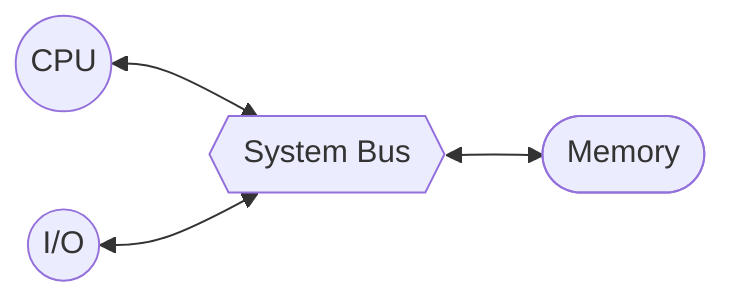

---
tags:
  - school
subject: Computer Structure/System
---
# 컴퓨터란
- 프로그램의 처리
- 프로그램: 기계어 명령어의 집합
- 즉 컴퓨터는 데이터 프로세싱 머신임
# 컴퓨터시스템의 구성
- 응용 소프트웨어
- 시스템 소프트웨어
- 하드웨어
# 컴퓨터의 기본 구조
- 컴퓨터는 프로그램 코드들을 정해진 순서대로 실행
	- 필요한 데이터를 읽어서(Read) 처리(Processing)하고 저장(Store)
- 기본 구성요소는 중앙 처리장치, 기억장치, 입출력 장치 가 있다
<center><b> 폰 노이만 아키텍처</b></center>

# 컴퓨터의 주요 구성요소
## 1. 중앙 처리 장치 (CPU)
- 프로세서 (Processer)
- '프로그램 실행'과 '데이터 처리'라는 중추적인 기능의 처리를 담당
## 2. 기억장치 (Memory)
- CPU가 실행할 프로그램과 데이터를 저장하는 장치
### 주 기억장치
- CPU 가까이 위치하며 반도체 기억장치 칩들로 구성
- 고속 엑세스
- 가격이 높고 면적을 많이 차지 ➡️ 저장 용량의 한계
- 영구 저장 능력이 없기 때문에 프로그램 실행 중에 일시적으로 사용
### 보조 기억장치
- 2차 저장장치
- 저장 밀도가 높고 비트당 가격이 낮음
- 엑세스 속도가 느림
- 영구 저장 능력을 가진 저장장치: HDD, CD-ROM, 플래시 메모리(Flash Memory) 등
## 3. 입출력 장치 (I/O Device)
- 사용자와 컴퓨터간의 대화를 위한 입력/출력 장치
- 유무선 통신 네트워크 인터페이스 장치
## 4. 시스템 버스
- CPU, 주 기억장치, I/O간의 통신
# 정보의 표현과 저장
- 컴퓨터 정보
	- 프로그램 코드와 데이터
	- 2진수 비트(0과 1)들로 표현
## 컴퓨터 언어의 분류
### 기계어 (Machine Language)
- 기계 코드, CPU가 이해할수 있는 언어
- CPU에 따라 다른 명령어 집합을 사용
- 2진수 비트로 구성
### 어셈블리 언어 (Assembly Language)
- 고급 언어와 기계어 사이의 중간 언어
- 저급 언어, 기계어와 1:1 대응
- 어셈블러(Assembler)로 번역
### 고급 언어 (High-Level Language)
- 영문자와 숫자로 구성되어 사람이 이해하기 쉬운 언어
- c++, 파스칼, 포트란, 코볼 등 ⬅️ 개틀딱 언어들
- 컴파일러(Compiler)를 이용하여 기계어로 번역
## 프로그램 언어 번역 소프트웨어
### 어셈블러
- 어셈블리 ➡️ 기계어
- 니모닉스()
	- 기계어 명령어가 어떤 역할을 하는디 대략적으로 유추할수 있도록 만든 기호
	- ex) 'LOAD', 'ADD', 'STOR' 등
### 컴파일러
- 고급 언어를 기계어로 바꿔주는 프로그램
## 기계 명령어의 형식
### 연산 코드 (OP Code)
- CPU가 수행할 연산을 지정해 주는 비트들
### 오퍼랜드 (Operand)
- 연산에 사용될 데이터 혹은 주소가 저장되어 있는 기억장치 주소

| 연산 코드                | 오퍼랜드  |
| --- | --- |
| <center>001</center> | <center>00101</center> |
## 프로그램 코드와 데이터의 기억장치 저장
- 프로그램 코드와 데이터는 지정된 기억 장치에 저장
### 단어(Word)
- 각 기억 장소에 저장되는 데이터의 **기본 단위**
- CPU에 의해 한번에 처리 됭수 있는 비트들의 그룹
- 주소 지정 단위: 단어 단위 or 바이트 단위
# 프로그램 콘셉트
## 하드웨어 프로그래밍
- 일정한 상황에 커스텀된 하드웨어
- 새로운 프로그램을 만들때는 새 하드웨어 만들어야 함
- 유연하지 않음
## 범용 목정 하드웨어
- 컨트롤 시그널을 변경하는것으로 다른 일을 수행 가능함
- 다시 와이어링 하는 대신에 새로운 컨트롤 시그널의 집합을 제공한다
## 소프트웨어 프로그래밍
- 범용 목적으로 설정된 산술, 논리 함수
### 프로그램이란?
- 단계의 
- 한 스텝마다 산술, 논리 연산이 끝남
- 각각의 연산마다 다른 컨트롤 시그널이 필요하다. 그리고 하드웨어에 적용한다
- 새 프로그램 => 새 코드 => 새 컨트롤 시그널
# CPU와 메모리의 접속
## 시스템 버스
CPU와 시스템  내의 다른 요소들 사이에 **정보를 교환 가능한 통로**
##### 기본 구성
- 주소 버스<sub>Adressable Bus</sub>
- 데이터 버스<sub>Data Bus</sub>
- 제어 버스<sub>Control Bus</sub>
### 주소 버스
- cpu가 외부로 발생하는 **주소 정보를 외부로 전달하는 역할**
- 주소 선들의 수는 **CPU와 연결 가능한 최대 기억장치 용량을 결정**
	- 주소 버스의 비트 수 = 16 비트라면, (8088의 경우)최대 2<sup>16</sup> = 64K 개의 기억 장소들의 주소를 지정 가능
### 데이터 버스
- CPU가 기억장치 혹은 I/O 장치와의 사이에 데이터(data, instruction)를 전송하기 위한 선들의 집합
- 데이터 선들의 수는 cpu가 **한번에 전달 가능한 비트수를 결정**
	- 데이터 버스 폭 = 32 비트라면, CPU와 기억장치 간의 데이터 전송은 한 번에 32 비트씩 가능
### 제어 버스
- cpu가 시스템 내의 각종 요소들의 동작을 제어하기 위한 신호 선들의 집합
- Control and timing information
	- Memory read/write signal
	- Interrupt request
	- Clock signals
	- access/use of data/address lines
## 싱글 버스 문제 -> 멀티플 버스 구조
- 많은 기기가 버스에 물려 있으면:
	- *Propagation delays*
		- 긴 데이터 경로는 버스 사용의 조정이 성능에 부정적인 영향을 미칠 수 있다
		- 집합적인 데이터 전송이 버스 용량에 접근할 경우
		- 더 많은 장치가 있을수록 지연이 길어집니다.
- 대부분의 기기는 여러 버스를 사용해서 이문제를 해결합니다
# ISA 컴퓨터 구조
- ![[ISA Computer struncture.jpg|right|350]]                               ISA 컴퓨터 구조 ➡️
- **von Neumann 구조**
	- 프로그램 코드를 기억장체어 저장된 순서대로 실행한다.
	- 그 주소는 CPU 내부 레지스터인 **Program Counter**에 의하여 지정
###### 레지스터 집합
- **MBR** (Memory Buffer Register)
	- 메모리에 저장할 단어를 포함하거나 메모리에서 방금 메모리에서 수신한 단어
- **MAR** (Memory Address Register)
	- 저장하거나 검색할 단어의 메모리 주소를 지정. 저장하거나 검색할 단어의 메모리 주소를 지정
- **IR** (Instruction Register)
	- 현재 실행 중인 8비트 연산 코드를 저장
- **IBR** (Instruction Buffer Register)
	- 단어의 오른쪽 명령어를 위한 임시 저장소인 메모리에 저장
- **PC** (Instruction Buffer Register)
	- 다음 명령의 주소 - 메모리에서 가져올 명령어 쌍을 저장
- **AC** (Accumulator) & **MQ** (Multiplier quotient)
	- 피연산자와 ALU 연산 결과를 저장
- - -
## ISA 컴퓨터의 동작
1. **가져오기 사이클(인출)**
	- 다음 명령어의 op 코드가 IR에 로드됩니다.
	- 주소가 MAR에 로드됨 - 명령어가 메모리에서 IBR 또는 MBR로 내려간 다음 IBR, IR, MAR로 내려갑니다.
2. **실행 주기(op 코드가 IR에 있는 경우)**
	- 제어 회로가 op 코드를 해석하고 명령어를 실행
		- 데이터 전송
		- 무조건 분기
		- 조건부 분기
		- 산술 연산
		- 주소 수정

> [!example]- ISA 컴퓨터의 동작 순서도
> ```mermaid
> %%{ init: { 'flowchart': { 'curve': 'stepAfter' } } }%%
> 
> flowchart TD
> start(["Start"]) --> id1{"다음 인스트럭션 코드가\nIBR에 있는가?"}
> 
> 	id1 -->|"Yes\n\n\n 메모리 접근이\n필요하지 않음"| id2["IR <- IBR(0:7)\nMAR <- IBR(8:19)"]
> 	id1 -->|No| id3["MAR <- PC"]
> 	id3 --> id4["MBR <- M(MAR)"]
> 	id4 --> id5{"남은\n인스트럭션 코드가\n필요한가?"}
> 	id5 -->|NO| id6["IR <- MBR(20:27)"]
> 	id5 -->|Yes| id7["IBR <- MBR(20:39)\nIR <- MBR(0,7)\nMAR <- MBR(8:19)"]
> 	id2 --> id8["PC <- PC + 1"]
> 	
> 	
> 	id6 --> id8
> 	id7 --> id111["MBR <- M(MAR)"]
> 	id111 --> id1111["AC <- AC + MBR"]
> 	
> 	id8 --> id9(IR의 인스트럭션을 해석)
> 	
> 	id9 -->|"AC <- MBR"| id10["MBR <- M(MAR)"]
> 	id10 --> id11["AC <- MBR"]
> 	
> 
> 	id9 -->|"M(X,0:19)로 이동"| id12["PC <- MAR"]
> 	
> 
> 	id9 -->|"만약 AC > 0 이라면\nM(X,0:19)로 이동"| id13{"AC > 0"}
> 	id13 -->|Yes| id12
> 	
> 
> 	id9 -->|"AC <- AC + M(X)"| id111
> 	
> 
> id13 --> tostart
> tostart ---> id1
> id12 --> tostart
> id11 --> tostart
> id1111 --> tostart((to start))
> ```
