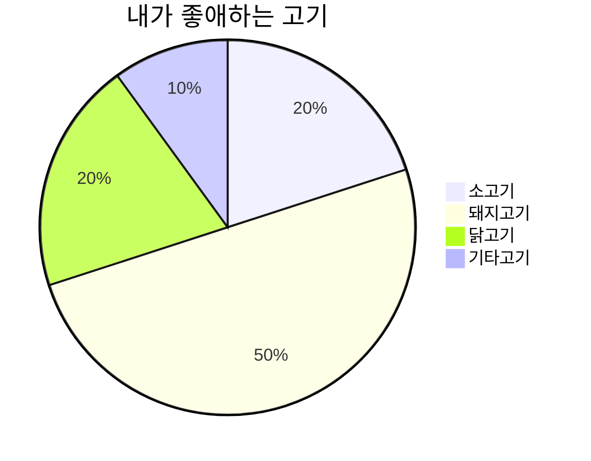
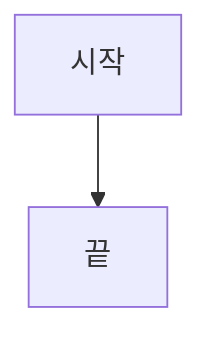
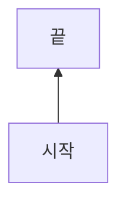

# 파이 차트

```mermaid
pie title 내가 좋애하는 고기
	"소고기": 20
	"돼지고기": 50
	"닭고기": 20
	"기타고기": 10
```
# 그래프

```mermaid
graph TD
	시작 --> 끝
```

```mermaid
graph TB
	시작 --> 끝
```

```mermaid
graph BT
	시작 --> 끝
```

```mermaid
graph TD
	시작 --> 끝
```
# 노드 모