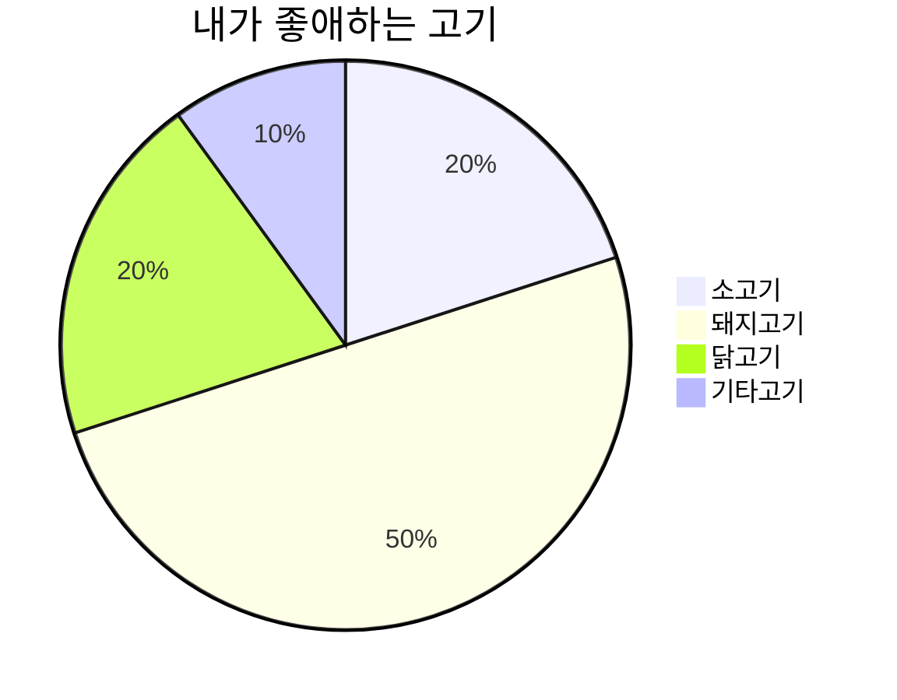
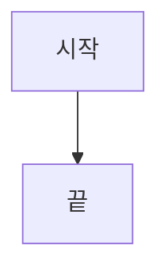
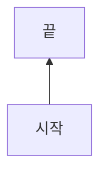
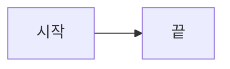
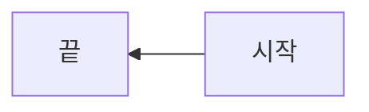
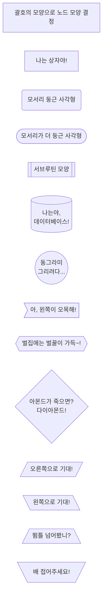
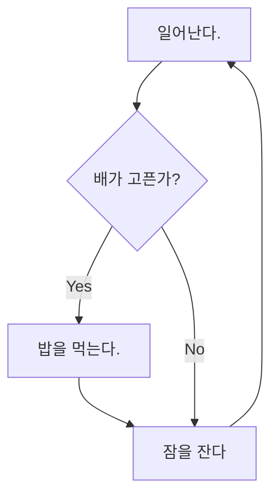

# 파이 차트

```mermaid
pie title 내가 좋애하는 고기
	"소고기": 20
	"돼지고기": 50
	"닭고기": 20
	"기타고기": 10
```
# 그래프

```mermaid
graph TD
	시작 --> 끝
```

```mermaid
graph TB
	시작 --> 끝
```

```mermaid
graph BT
	시작 --> 끝
```

```mermaid
graph LR
	시작 --> 끝
```

```mermaid
graph RL
	시작 --> 끝
```
# 노드 모양

```mermaid
graph LR
	모양["괄호의 모양으로 노드 모양 결정"]
	id["나는 상자야!"]
	
	둥근사각("모서리 둥근 사각형")
	더둥근사각(["모서리가 더 둥근 사각형"])
	서브루틴[["서브루틴 모양"]]
	납작원통[("나는야,\n데이터베이스!")]
	동그라미(("동그라미\n그리려다..."))
	왼쪽오목>"아, 왼쪽이 오목해!"]
	육각{{"벌집에는 벌꿀이 가득~!"}}
	
	마름모{"아몬드가 죽으면?\n다이아몬드!"}
	오른평행[/"오른쪽으로 기대!"/]
	왼평행[\"왼쪽으로 기대!"\]
	사다리꼴[/"뜀틀 넘어봤니?"\]
	거꿀사라디[\"배 접어주세요!"/]
```
# 사용예

```mermaid
graph TD
	A[일어난다.] --> B{배가 고픈가?}
	B -- Yes --> C[밥을 먹는다.] --> D[잠을 잔다]
	B -- No --> D
	D --> A
```
---
[머메이드 홈페이](https://mermaid.js.org/#/)